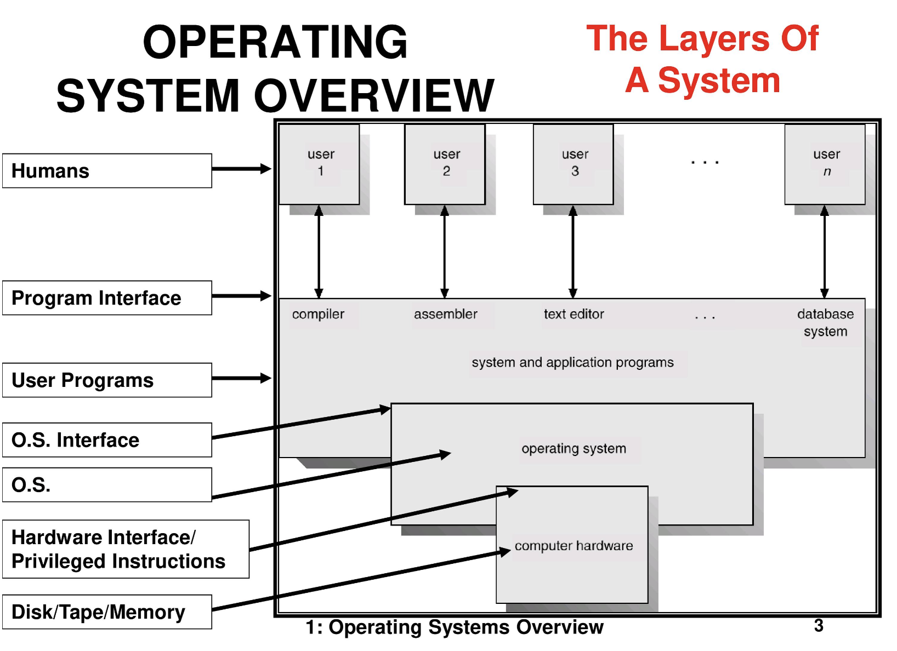

# Chapter 1. Introduction

An Operating System is software that manages a computer's hardware.
 
 

> **Objectives**
>
> - Describe the general organisation of a computer system and the role of interrupts.
> - Describe the components in a modern multiprocessor computer system.
> - Illustrate the transition from user mode to kernel mode.
> - Discuss how operating systems are used in various computing environments.
> - Provide examples of free and open-source oprating systems.

 

| Chapter |             Title              |                   Link                   |
| :-----: | :----------------------------: | :--------------------------------------: |
|   1.1   |   What Operating Systems Do    | 📖 [READ](#11-what-operating-systems-do) |
|   1.2   |  Computer-System Organisation  |                                          |
|   1.3   |  Computer-System Architecture  |                                          |
|   1.4   |  Operating-System Operations   |                                          |
|   1.5   |      Resource Management       |                                          |
|   1.6   |    Security and Protection     |                                          |
|   1.7   |         Virtualisation         |                                          |
|   1.8   |      Distributed Systems       |                                          |
|   1.9   |     Kernel Data Structures     |                                          |
|  1.10   |     Computing Environments     |                                          |
|  1.11   | Free and Open-Source Operating |                                          |

---

 

## 1.1 What Operating Systems Do

- Controls the hardware and coordinates its use among the various application programs for the various users.
- Provides the means for proper use of these resources in the operation of the computer system.
- [reference: learnpick.in](https://www.learnpick.in/prime/documents/ppts/details/510/operating-systems-overview)
  

### 1.1.1 User View

- A system is designed for one user to monopolise its resources.
- The goal is to maximise the work that user is performing ( **Ease of use > resource utilisation**)

### 1.1.2 System View

- The program most intimately involved with the hardware
  - The OS must decide how to allocate them to specific programs and users so that it can operate the computer system efficiently and fairly.
- OS is a control program manages the execution of user programs to prevent errors and improper use of the computer, especially concerned with the operation and control of I/O devices.

### 1.1.3 Defining Operating Systems

- The fundamental goal of computer systems is to execute programs and to make solving user problems easier.
  - The common functions of controlling and allocationg resources are brought together into one piece of software: the operating system
  - Kernel: The one program running at all time on the computer

