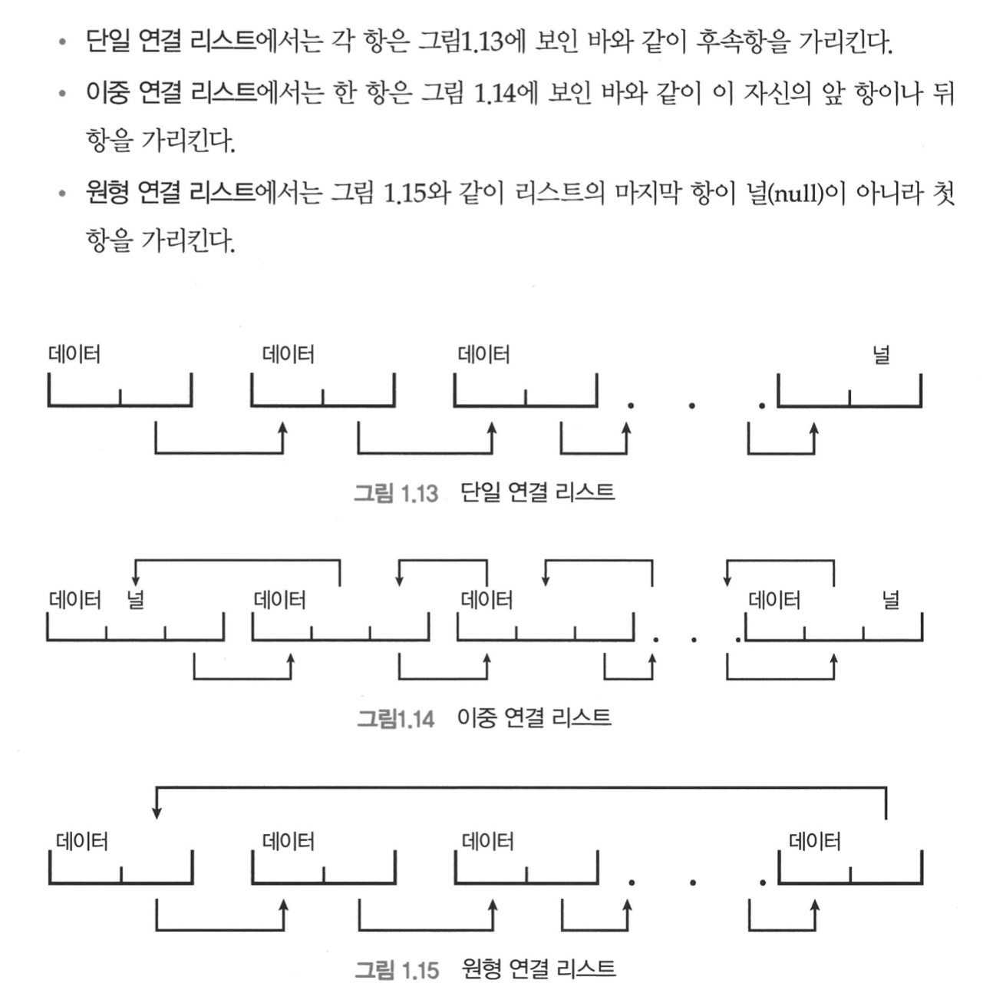
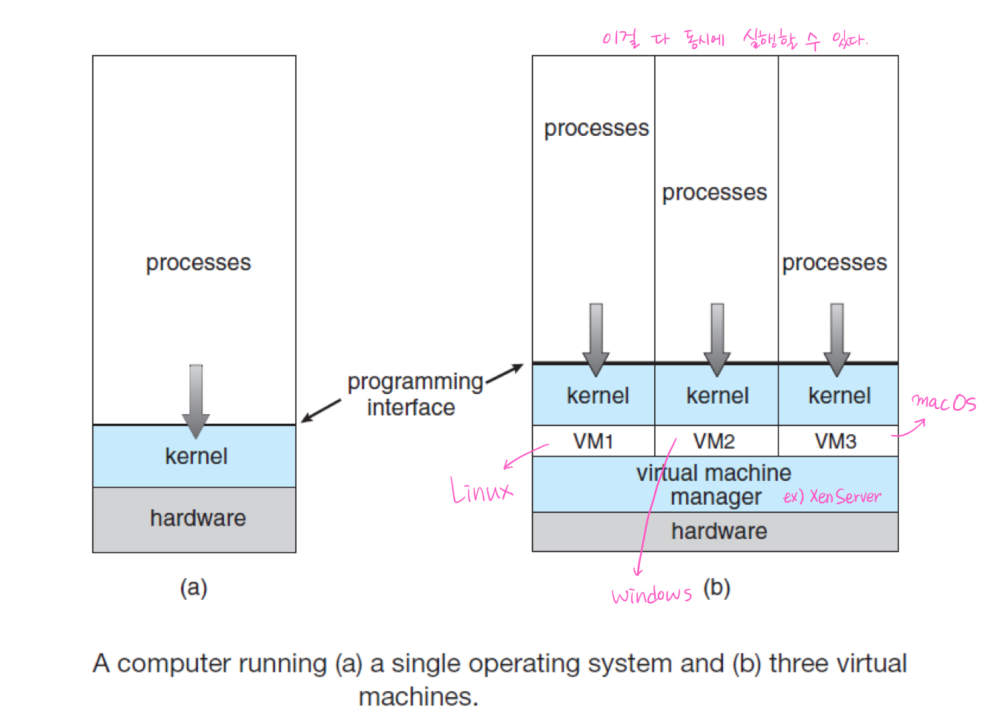
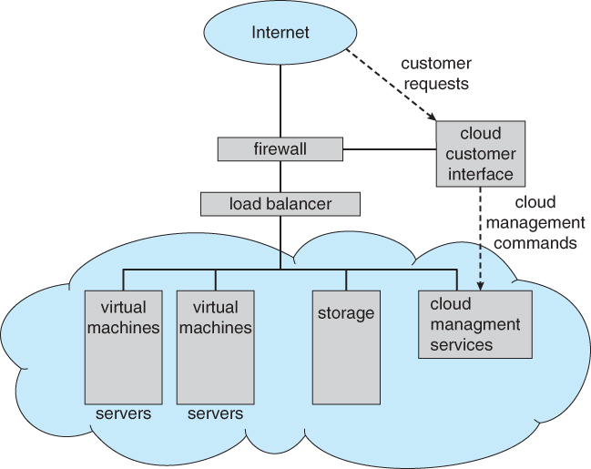

# Chapter 1. Introduction

An Operating System is software that manages a computer's hardware.
 
 

> **Objectives**
>
> - Describe the general organisation of a computer system and the role of interrupts.
> - Describe the components in a modern multiprocessor computer system.
> - Illustrate the transition from user mode to kernel mode.
> - Discuss how operating systems are used in various computing environments.
> - Provide examples of free and open-source oprating systems.

 

| Chapter |             Title              |      Link       |
| :-----: | :----------------------------: | :-------------: |
|   1.1   |   What Operating Systems Do    | 📖 [READ](#1-1) |
|   1.2   |  Computer-System Organisation  |                 |
|   1.3   |  Computer-System Architecture  |                 |
|   1.4   |  Operating-System Operations   |                 |
|   1.5   |      Resource Management       |                 |
|   1.6   |    Security and Protection     |                 |
|   1.7   |         Virtualisation         |                 |
|   1.8   |      Distributed Systems       |                 |
|   1.9   |     Kernel Data Structures     |                 |
|  1.10   |     Computing Environments     |                 |
|  1.11   | Free and Open-Source Operating |                 |

---

 

# Chapter 1. 서론

## 1.1 운영체제가 할 일

컴퓨터 시스템의 구성요소

1. 하드웨어 - 기본 계산용 자원 제공
   1. 중앙 처리 장치(CPU)
   2. 메모리
   3. 입출력 장치
2. 운영체제
3. 응용 프로그램
4. 사용자

컴퓨터 시스템은 다시 하드웨어, 소프트웨어, 데이터로 구성되어 있다고도 할 수 있다.

**운영체제의 역할: 컴퓨터 시스템이 동작할 때 이들 자원을 적절하게 사용할 수 있는 방법을 제공**

#### 1.1.1 사용자 관점(User view)

- PC: 사용의 용이성을 위해 설계되고 자원의 이용에는 신경쓰지 않는다.
- 대형 컴퓨터: 자원의 이용을 극대화하도록 설계
- 워크스테이션: 개인 사용의 용이성과 자원의 이용이 적절히 조화를 이루도록 설계
- 스마트폰: 사용자 인터페이스로서 터치 스크린을 사용
- 가전제품/자동차 내 내장형 컴퓨터: 이들의 컴퓨터나 운영체제는 사용자의 개입 없이 작동하도록 설계

#### 1.1.2 시스템 관점(System View)

- 시스템 관점에서 운영체제를 자원 할당자(resource allocator) 라고 볼 수 있음
- CS는 문제를 해결하기 위해(사용자의 요구를 처리하기 위해) 여러가지 자원들을 가진다
  - CPU 시간, 메모리 공간, 파일 저장 공간, 입출력 장치 등 👉🏼 운영체제가 이들을 관리함, 슈퍼바이저의 역할.
  - 요청을 처리하는 과정에서 자원들이 서로 상충될 수도 있기 때문에 운영체제는 컴퓨터 시스템을 효율적이고 공정하게 운영할 수 있도록 어느 요청에 자원을 할당할지 정해야 한다
- 즉, 운영체제는 control program. (특히 입출력 장치의 제어와 작동에 깊이 관여함)

#### 1.1.3 운영체제의 정의

- 운영체제가 존재하는 이유
  - 운영체제가 우용한 컴퓨터 시스템을 만드는 과정에서 발생하는 문제점을 해결하기 위한 적절한 방법이기 때문
  - 컴퓨터 시스템의 근본 목적: 사용자의 프로그램 실행 및 문제 해결을 도움 👉🏼 이런 목적으로 하드웨어가 제작
  - 하드웨어 만으로는 모든 문제 해결을 하는 것이 어렵기 때문에 소프트웨어가 등장

## 1.2 컴퓨터 시스템의 구성

컴퓨터 시스템 구조에 대한 일반적인 지식

#### 1.2.1 컴퓨터 시스템 연산(Computer-System Operation)

컴퓨터가 동작하기 위해서는 수행할 초기 프로그램을 가져야 한다. 예를 들면 전원이 켜지거나 재부트 될 때도 프로그램이 필요하다. 이 초기 프로그램을 부트스트랩이라고 부르는데, 이 부트스트랩은 ROM이나 EEPROM에 저장된다. 이 부트스트랩은 CPU레지스터로부터 장치 제어기, 메모리 냉ㅇ 등을 포함한 시스텡의 모든 면을 초기화 한다. 부트스트랩 프로그램은 운영체제의 커널을 찾아 메모리에 적재해야 한다.

커널이 적재되고 수행이 시작되면 시스템과 사용자에게 서비스를 제공할 수 있다. 그리고 이 단계가 끝나면 시스템이 완전히 부트된 상태고 사용자가 서비스를 이용할 준비가 된 것이다!

이제 시스템은 무슨 사건(event)이 발생하기를 기다린다.(사용자가 앱을 켠다던지, 키보드를 누른다던지, 마우스를 클릭한다던지 등...)

사건이 발생하는 것을 하드웨어나 소프트웨어로부터 인터럽트(interrupt)가 발생했다고 말한다.

#### 1.2.2 저장 장치 구조(Storage Structure)

ROM은 변경할 수 없으므로 앞에 설명한 부트스트랩 프로그램과 같은 정적 프로그램을 저장한다. 예를 들어 스마트폰은 공장에서 설치한 프로그램을 저장하기 위해 EEPROM을 사용한다. - ROM: 읽기 전용 메모리 - EEPROM: 전기적으로 소거 가능한 프로그램 가능-읽기 전용 메모리(단 자주 변경할 수 없음)

폰 노이만 구조 시스템에서 실행되는 명령-실행 사이클(instuction-execution cycle)은 먼저 메모리로부터 명령을 인출해 그 명령을 명령 레지스터(instruction register)에 저장한다. 이어서 명령을 해독하고 이것은 메모리로부터 피연산자를 인출해 내부 레지스터에 저장하도록 유발할 수 있다. 메모리 장치는 단지 일련의 메모리 주소만을 인식한다는 사실에 유의하자! 메모리는 이들 주소가 어떻게 생성되었는지도, 어떻게 생성되었는지도 모른다. 우리는 단지 실행중인 프로그램에 의해 생성된 메모리 주소에만 흥미가 있다! 이상적으로는 프로그램과 데이터가 주 메모리에 영구히 존재하기를 원하지만 다음 두 가지의 이유 때문에 불가능하다.

1. 주 메모리는 모든 필요한 프로그램과 데이터를 영구히 저장하기에는 너무 작다.
2. 주 메모리는 전원이 공급되지 않으면 그 내용을 잃어버리는 휘발성 저장 장치다.

#### 1.2.3 입출력 구조(I/O Structure)

저장 장치는 컴퓨터 내의 여러 형태의 입출력 장치 중의 하나다. 시스템의 신뢰성과 성능에 미치는 중요성 때문에 운영체제 코드의 많은 부분이 입출력을 관리하는데 할애된다.

인터럽트 구동 방식의 입출력은 적은 양의 데이터를 전송하는데는 문제가 없지만 디스크 입출력과 같은 대량의 데이터를 전송할 때는 높은 오버헤드를 초래한다. 이 문제를 해결하기 위해 DMA 장치가 사용된다. 한 바이트마다 인터럽트가 발생하는 것이 아니라 블록 전송이 완료될 때마다 인터럽트가 발생한다. CPU의 간섭이 없기 때문에 장치 제어기가 전송 작업을 수행하고 있는 동안 CPU는 다른 작업을 수행할 수 있다. (예를 들어 유튜브에서 영상을 보는 경우 CPU가 할 일이 별로 없다. 네트워크에서 스크린으로 바로 보내주면 됨. 따라서 CPU는 그동안 다른 작업을 수행할 수 있음.)

## 1.3 컴퓨터 시스템의 구조

1.2에서는 전형적인 컴퓨터 시스템의 일반적인 구조를 봤다. 컴퓨터 시스템은 사용된 범용 처리기의 수에 따라 3가지로 분류가 가능하다.

- 단일 처리기 시스템(Single-Processor Systems)
- 다중 처리기 시스템(Multiprocessor Systems)
- 클러스터형 시스템(Clustered Systems)

#### 1.3.1 단일 처리기 시스템(Single-Processor Systems)

단일 처리기 시스템은 하나의 주 CPU를 가진다. 그리고 이 하나의 CPU 는 사용자 프로세스의 명령어를 포함해 범용 명령어 집합을 수행할 수 있다.

#### 1.3.2 다중 처리기 시스템(Multiprocessor Systems)

다중 처리기 시스템은 주로 서버에 이용되었으나 이후 desktop/laptop으로 이동했다. 최근에는 스마트폰이나 tablet 컴퓨터와 같은 휴대용 장치에도 등장하고 있다.

다중 처리기 시스템의 장점

- 처리량 증가(throughput)
  - 처리기 수의 증가로 더 짧은 시간에 더 많은 일을 할 수 있기를 바라지만 N개의 처리기를 사용할 경우 속도 증가율은 N 배가 되지 않고, N 보다 작다.
- 경제적 규모
  - 여러 개의 단일 시스템에 비해 비용 절약이 가능하다. 이는 처리기가 주변 장치, 대용량 저장 장치, 전원 공급 장치를 공유하고 있기 때문이다.
- 신뢰성 증가
  - 한 처리기가 고장 나더라도 시스템이 정지하는 것이 아니라 속도만 느려지게 된다.

다중 처리기 시스템의 형태

- 비대칭적 다중 처리(asymmetric multiprocessing)
  - 하나의 주 처리기가 시스템을 제어
- 대칭적 다중 처리(symmetric multiprocessing)
  - 모든 처리기가 대등하며 처리기 간의 주종관계가 없다.
    

CPU를 설계하는 최근의 경향은 하나의 칩에 여러 개의 코어(core)를 포함하는 것이다. 이런 다중 처리기 시스템을 멀티코어라 부른다. 이들능ㄴ 단일 코어를 가진 여러 개의 칩보다 효율적이다.(칩 내의 통신이 칩 간의 통신보다 빠르고, 전력을 덜 소모한다.)

#### 1.3.3 클러스터형 시스템(Clustered Systems)

클러스터형 시스템은 여러 CPU를 가진 또 다른 시스템의 유형이다. 클러스터 시스템은 둘 이상의 독자적 시스템 또는 노드를 연결하여 구성한다는 점에서 다중 처리기 시스템과 차이가 난다. 일반적으로 클러스터 컴퓨터는 저장 장치를 공유하고 근거리 통신망(Local Area Network, LAN)이나 InfiniBand 같은 고속의 상호 연결망으로 연결된다.

한 클러스터가 네트워크로 연결된 다수의 컴퓨터 시스템으로 구성되므로 클러스터는 고성능 계산 환경을 제공할 수 있다.

## 1.4 운영체제의 구조

운영체제는 프로그램이 수행될 환경을 제공한다. 운영체제의 내부 구조는 매우 다양하지만 그들 사이에 많은 공통점들이 있고 그 공통점들을 이 절에서 알아본다.

운영체제의 가장 중요한 면은 다중 프로그램(Multiprogram)을 할 수 있는 능력이다. 일반적으로 단일 사용자는 CPU나 입출력 장치를 항상 바쁘게 유지하는 것이 불가능하다. 다중프로그래밍은 CPU가 수행할 작업(코드와 데이터)을 항상 하나 가지도록 작업을 구성함으로써 CPU 이용률을 증가시킨다.

방법: 
운영체제는 한 번에 여러 작업을 메모리에 적재한다.
 
이들 작업들은 처음에는 디스크의 **작업 풀(pool)**에 유지된다. 메모리 내에 동시에 저장할 수 있는 작업의 수는 일반적으로 작업 풀에 둘 수 있는 작업의 수보다 훨씬 적기 때문이다. 작업 풀은 디스크 내의 모든 프로세스로 구성되며 이들은 주 메모리의 할당을 기다린다.

쉽게 말해, 다중 프로그래밍 시스템은 줄 서 있는 임무들이 있고 운영체제가 그 작업을 하나씩 수행한다. 그런데 그 중 어떤 작업은 좀 기다려야 하는 일이라면 그 기다리는 시간 동안에 다른 일을 할 수 있다. 즉, 수행할 작업이 하나라도 있는 한 CPU는 쉬지 않는다.

멀티태스킹은 다중 프로그래밍의 논리적 확장이다. 멀티태스킹 시스템에서는 CPU가 다수의 작업들을 교대로 수행하지만, 매우 빈번하게 교대가 일어나 프로그램이 실행되는 동안에 사용자들은 각자 자기의 프로그램과 상호작용 할 수 있다.

이러한 멀티태스킹 시스템은 사용자와 시스템 간에 직접적인 통신ㅇ르 제공하는 interactive 컴퓨터 시스템을 필요로 한다. 사용자는 키보드나 마우스 등의 입력 장치를 이용해 운영체제나 프로그램에 직접 명령하고 출력 장치의 즉각적인 응답을 기다린다. 따라서 응답 시간이 짧아야 한다.

멀티태스킹 운영체제는 많ㅇ느 사용자가 컴퓨터를 공유할 수 있도록 하기도 한다. 멀티태스킹 시스템에서 각각의 동작이나 명령은 대체로 짧기 때문에 각 사용자는 단지 짧은 시간 동안만 CPU 시간이 필요하다. 따라서 각 사용자는 본인이 전체 컴퓨터를 사용하는 것처럼 느끼지만 실제로는 다수의 사용자가 하나의 컴퓨터를 공유하는 것이다.

이러한 멀티태스킹 운영체제는 각 사용자에게 컴퓨터의 작은 부분을 제공하기 위해 (1) CPU 스케줄링 (2) 다중 프로그래밍(multiprogramming)을 사용한다. 각 사용자는 메모리에 최소한 하나의 독립된 프로그램을 가지고 있다. 프로세스가 수행될 때는 그 프로세스가 종료되거나 입출력을 수행할 필요가 있을 때까지 아주 짧은 시간 동안만 실행된다. 이러한 입출력은 대화식(인터랙티브)일 수 있다. 입력은 사용자의 키보드나 마우스 등으로 들어오고 사람이 키보드를 타이핑 할 때 1초에 7문자면 빠른 편이지만 컴퓨터 입장에서는 아주 느린 것이다. (시간의 상대성!) 이러한 대화식 입력이 진행되는 동안 운영체제는 CPU를 쉬게 냅두는 것이 아니라 다른 사용자의 프로그램으로 신속하게 전환한다.

멀티프로그래밍에서는 여러 작업이 동시에 메모리 위에 유지되어야 한다. 만약 메모리에 보관할 만한 공간이 충분하지 않다면 시스템은 그들 중 몇 개를 선택해야 한다. 이런 결정을 하는 것을 **작업 스케줄링** 이라고 하며 5장에서 만날 수 있다!

## 1.5 운영체제 연산

현대의 운영체제는 인터럽트 구동식(interrupt driven)이다. 실행할 프로세스도 없고, 서비스할 입출력 장치도 없고, 응답해줄 사용자도 없으면 운영체제는 조용히 앉아 무언가가 일어나기를 기다리고만 있을 것이다. 사건은 대부분 인터럽트나 트랩을 발생시켜 신호를 보낸다. 여기서 트랩도 인터럽트의 일종인데, 유효하지 않은 메모리 접근 등으로 발생하는 오류나, 소프트웨어에 의해 생성되는 인터럽트를 말한다.

운영체제와 사용자는 하드웨어와 소프트웨어 자원을 공유하기 때문에 혹시나 사용자 프로그램에 오류가 있더라도 현재 수행중인 프로그램에만 문제를 일으키도록 보장해야 한다.

#### 1.5.1 이중 연산 모드

운영체제가 슈퍼바이저로서 일을 잘 하게 하기 위해 운영체제를 크게 2가지 모드로 나눠 하드웨어에 자원을 지원을 제공하는 것이다. 즉, 두개의 독립된 연산 모드 (1)사용자 모드 (2)커널 모드(슈퍼바이저 모드, 시스템 모드, 특권 모드 라고도 부른다)

시스템 부트 시 하드웨어는 커널 모드에서 시작한다. 이어 운영체제가 적재되고, 사용자 모드에서 사용자 프로세스가 시작된다. 트랩이나 인터럽트가 발생할 때마다 하드웨어는 사용자 모드에서 커널 모드로 전환한다. 그러므로 운영체제가 컴퓨터의 제어를 얻을 때마다 항상 커널 모드에 있게 된다. 시스템은 사용자 프로그램으로 제어를 넘기기 전에 항상 사용자 모드로 전환한다.

이러한 이중 모드는 사용자와 운영체제 서로를 보호하는 방법을 제공한다.

// VMM 에 대한 추가 공부 필요

#### 1.5.2 타이머

사용자의 프로그램이 무한 루프에 빠지거나 시스템 서비스 호출에 실패해 제어가 운영체제로 복귀하지 않는 경우가 없도록 타이머를 사용할 수 있다. 타이머는 지정된 시간 이후 컴퓨터를 인터럽트 하도록 설정할 수 있다.

## 1.6 프로세스 관리

프로그램은 그 명령이 CPU에 의해 수행되지 않으면 아무 일도 할 수 없다. 언급한 것처럼 실행중인 프로그램이 프로세스이다. 컴파일러와 같은 하나의 멀티태스킹 사용자 프로그램은 하나의 프로세스가 된다.

프로세스는 자신의 일을 수행하기 위해 CPU 시간, 메모리, 파일, 그리고 입출력 장치를 포함한 여러 가지 자원을 필요로 한다. 이러한 자원은 프로세스가 생성될 때 제공될 수도 있고 실행되는 동안 할당될 수도 있다.

프로그램 그 자체는 프로세스가 아니다! 하나의 프로그램은 디스크에 저장된 파일의 내용과 같이 수동적인 개체인 반면 프로세스는 능동적이다. 여기서 능동적이라 함은 다음 수행할 명령을 지정하는 프로그램 카운터(program counter)를 가졌다는 것이다. 👉🏼 thread 에서 자세히 보자!

CPU는 두 개의 프로세스가 동일한 프로그램과 연관되어 있더라도 별도의 수행 순서로 간주하고 그 프로세스가 끝날 때까지 프로세스의 명령들을 차례대로 수행한다. 다중 스레드 프로세스는 여러개의 프로그램 카운터를 가지고 있고 이 카운터들은 각 스레드가 실행할 다음 명령어를 가리키게 된다.

운영체제는 프로세스 관리와 연관해 다음과 같은 활동에 대한 책임을 진다.

- CPU에 프로세스와 스레드를 스케줄 하기
- 사용자 프로세스와 시스템 프로세스의 생성과 제거
- 프로세스의 일시 중지와 재수행
- 프로세스 동기화를 위한 기법 제공
- 프로세스 통신을 위한 기법 제공

## 1.7 메모리 관리

주 메모리는 CPU와 입출력 장치에 의하여 공유되는 빠른 접근이 가능한 데이터 저장소다. 폰 노이만 방식의 컴퓨터에서는 중앙 처리기가 명령어 인출 주기(instruction fetch-style)동안 주 메모리로부터 명령어를 읽고, 자료 인출 주기(data fetch-cycle)동안 주 메모리로부터 데이터를 읽고 쓴다. 주 메모리는 일반적으로 CPU가 직접 주소를 지정할 수 있고 또 CPU가 직접 접근 할 수 있는 유일한 대량 메모리다.

프로그램이 수행되기 위해서는 반드시 절대 주소로 매핑(mapping) 되고 메모리에 적재되어야 한다. 프로그램을 수행하면서 이런 절대 주소를 생성해 메모리의 프로그램 명렁어와 데이터에 접근한다. 프로그램이 종료되면 프로그램이 차지하던 메모리 공간은 가용공간이 되고 그 자리에 다음 프로그램이 적재되어 수행될 수 있다.

CPU 이용률과 사용자에 대한 응답 속도를 개선하기 위해 우리는 메모리에 여러개의 프로그램을 유지해야 하고 이를 위한 메모리 관리 기법이 필요하다. 이런 기법에는 여러 종류가 있고 여러 접근 방법을 반영하는데 효율성은 상황에 따라 달라진다. 특정 시스템에 대한 메모리 관리 기법의 선택은 특히 시스템의 하드웨어 설계에 좌우되고 각 알고리즘은 자신의 하드웨어 지원을 필요로 한다.

운영체제가 메모리를 위애 하는 일

- 메모리의 어느 부분이 현재 사용중이고 누구에 의해 사용되고 있는지 추적하기
- 어떤 프로세스들을 메모리에 적재하고 제거할 지 정하기
- 필요에 따라 메모리 공간을 할당하거나 회수하기

## 1.8 저장장치 관리

운영체제는 저장 장치의 물리적 특성을 추상화하여 논리적 저장 단위인 `파일`을 정의한다. 운영체제는 파일을 물리적 매체로 맵하며, 저장 장치를 통해 이들 파일에 접근한다.

#### 1.8.1 파일 시스템 관리

컴퓨터는 여러 타입의 물리적 매체에 정보를 저장 할 수 있다. (예: 자기 디스크, 광 디스크, 자기 테이프) 이러한 각 매체들은 디스크 드라이브나 테이프 드라이브와 같은 장치에 의해 제어되고 각각 독특한 특성을 가진다. 그 특성들을 예로 들자면, 접근 속도, 용량, 데이터 전송률, 접근 방식(순차 접근 방식/임의 접근 방식)이 있다.

파일은 파일 생성자에 의해 정의된 관련 정보의 집합체다. 일반적으로 파일은 프로그램과 데이터를 나타내며 데이터 파일은 숫자, 영문자 등으로 구성된다. 이러한 파일은 자유 형태일수도, 엄격하게 포맷된 형태 일 수도 있다.

운영체제는 테이프와 디스크 같은 대량 저장 매채와 그것을 제어하는 장치를 관리함으로서 파일의 추상적 개념을 구현한다. 이런 파일을 쉽게 사용하게 하기 위해 디렉토리 안에 넣을 수 있다.

**파일 관리를 위해 운영체제가 하는 일**

- 파일의 생성 및 제거
- 디렉토리 생성 및 제거
- 파일과 디렉토리를 조작하기 위한 프리미티브(primitive)의 제공
- 파일을 보조 저장 장치로 매핑
- 안정적인(비휘발성) 저장 매체에 파일을 백업

👉🏼 10장, 11장에서 자세히 다룰 것이다!

#### 1.8.2 대용량 저장장치 관리

주 메모리는 앞서 말한 것처럼 모든 데이터와 프로그램을 수용하기에 용량이 충분하지 못할 뿐 아니라, 전원이 꺼질 경우 데이터가 사라진다. 따라서 컴퓨터 시스템은 이러한 주 메모리 내요을 저장하기 위해 보조 저장 장치를 사용해야 한다. 컴파일러, 어셈블러, 워드 프로세서, 편집기, 포맷터 등 대부분의 프로그램은 주 메모리에 적재될 때 까지 디스크에 저장되어 있고, 처리의 출발지와 목적지로서 디스크를 사용한다. 그러므로 디스크 저장 장치의 적절한 관리는 CS에서 매우 중요하다.

**디스크 관리를 위해 운영체제가 하는 일**

- 자유 공간(free-space) 의 관리
- 저장 장소 할당
- 디스크 스케줄링

보조 저장 장치는 빈번하게 사용되므로 효율적으로 사용해야 한다. 하지만 이런 보조 저장 장치보다 느리더라도 용량이 더 큰 장치를 필요로 하는 경우도 있다. 디스크 데이터의 백업이나, 데이터 및 장기간 보존이 필요한 데이터를 저장하는 것이 대표적인 예다. 자기 테이프 드라이브나 CD, DVD 드라이브와 플래터들은 전형적인 **3차 저장** 장치의 예다.

3차 저장 장치는 시스템 성능에는 중요하지 않지만 여전히 운영체제에 의해 관리되어야 한다.

#### 1.8.3 캐싱(cashing)

캐싱은 컴퓨터 시스템의 중요한 원리다. 정보는 통상 주 메모리와 같은 어떤 저장 장치에 보관되는데 그 정보가 사용됨에 따라 보다 빠른 장치인 캐시에 일시적으로 복사된다. 그러므로 우리가 특정 정보가 필요할 경우, 먼저 캐시에 그 정보가 있는지 조사해봐야 한다. 만약 캐시에 있으면 그 정보를 가져와서 사용해야 하고, 이때 그 정보가 다음에 곧 다시 사용될 확률이 높다는 가정 하에 캐시에 넣는다.

캐시의 크기에 한계가 있기 때문에 캐시 관리가 설계의 중요한 문제가 된다. 캐시의 크기와 교체 정책을 잘 선택하면 모든 접근의 80~99%를 캐시에서 얻을 수 있기 때문에 성능이 극도로 높아질 수 있다.

주 메모리는 보조 메모리를 위한 빠른 캐시로 볼 수 있는데, 이는 보조 메모리의 데이터를 사용하기 위해서는 주 메모리에 복사되어야 하고, 안전하기 보관하기 위해 보조 메모리로 이동되기 전에 데이터는 반드시 주 메모리에 있어야 하기 때문이다. 파일 시스템 데이터는 저장 장치 계층의 여러 단계에 존재할 수 있는데, 최상위 단계에서는 운영체제가 주 메모리 안에 파일 시스템 데이터의 캐시를 유지할 수 있다.

저장 장치의 계층구조에서 각 수준간의 정보 이동은 하드웨어 설계나 제어하는 운영체제에 따라 이루어진다. 예를 들어 캐시로부터 CPU 및 레지스터로의 데이터 전송은 보통 운영체제의 간섭 없이 하드웨어적으로 이루어진다. 반면에 디스크와 메모리간의 데이터 전송은 통상 운영체제에 의해 제어된다.

// 34 쪽 메모리 계층 구조의 예시 공부하기

#### 1.8.4 입출력 시스템(I/O Systems)

운영체제의 목적 중 하나는 사용자에게 특정 하드웨어 장치의 특성을 숨기는 것이다. 예를 들어 UNIX에서 입출력 장치의 특성은 입출력 서브시스템에 의해 운영체제 자체의 대부분으로부터 숨겨져 있다.
  
입출력 시스템의 구성 요소

- 버퍼링, 캐싱, 스풀링을 포함한 메모리 관리 구성 요소
- 일반적인 장치 드라이버 인터페이스
- 특정 하드웨어 장치들을 위한 드라이버

13장에서 입출력 서브시스템이 다른 시스템 구성 요소와 어떻게 인터페이스하며, 장치를 관리하고, 데이터를 전송하며, 입출력 완료를 알아내는지 논의한다.

## 1.9 보호와 보안

**보호(protection)**는 컴퓨터 시스템이 정의한 자원에 대해 프로그램, 프로세스, 사용자들의 접근을 제어하는 기법이다. 보호는 구성 요소 서브시스템 간의 인터페이스에서 잠재적인 오류를 검출함으로써 시스템의 신뢰성을 증가시킬 수 있다.

컴퓨터 시스템은 충분한 보호 기능을 가지고 있더라도 여전히 고장나거나 부적절한 접근이 허용될 수 있다. 예를 들어 사용자 인증 정보가 도난당했다면 파일과 메모리 보호 기능이 작동하더라도 사용자의 데이터는 복사/삭제 될 수 있다. 이런 외부/내부 공격을 방어하는 기능이 **보안(security)**이다.

## 1.10 커널 자료 구조(Kernel Data Structures)

시스템에서 데이터가 구조화 되는 방법을 배운다.

#### 1.10.1 리스트, 스택 및 큐

배열은 각 원소가 직접 접근될 수 있는 단순한 자료구조다. 예를 들어 주 메모리는 하나의 배열로 구축된다.

<!-- //TODO: 배열 예시 추가하기 -->

배열에 이어 가장 기본적인 자료 구조는 리스트다. 배열의 각 항은 직접 접근할 수 있지만 리스트의 항들은 특정 순서로 접근해야 한다. 리스트는 데이터 값들의 집단을 하나의 시퀀스로 표시한다. 이 구조를 구현하는 가장 일반적 방법이 연결리스트(linked list)다. 연결 리스트에서는 각 항이 다른 하나에 연결되어 있는 형태고, 이러한 연결 리스트는 여러 유형이 있다.

- 단일 연결 리스트
- 이중 연결 리스트
- 원형 연결 리스트

리스트는 자주 스택이나 큐같은 강력한 자료구조를 구축하는데 사용한다.

**스택**은 순차적 순서를 가진 자료구조로 항을 넣거나 꺼내는데 후입선출(last in first out)을 사용한다. 즉, 스택에 마지막에 삽입된 항이 먼저 인출된다. 스택에 항을 삽입하거나 인출하는 일을 각각 push / pop 이라 한다. 운영체제는 함수를 호출할 경우 종종 스택을 사용한다. 함수를 호출할 때 스택이 인수, 로컬 변수 및 복귀 주소 등을 push하고 함수로부터 복귀할 때 이들 항을 스택으로부터 pop한다.

**큐** 는 선입선출(first in first out)을 사용한다. 각 항들은 삽입된 순서대로 큐에서 제거된다.

#### 1.10.2 트리

트리는 데이터 서열을 표시하는데 사용 가능한 자료구조다. 트리 구조에서 데이터 값들은 부모-자식 관계에 의해 연결된다. 일반 트리(general tree)에서 부모는 임의의 수의 자식을 가질 수 있다. 이진 트리에서 부모는 최대 두 개의 자식을 가질 수 있고 각각을 좌측자식, 우측자식이라 부른다.

#### 1.10.3 해시 함수와 맵

해시 함수는 데이터를 입력으로 받아 이 데이터에 산술 연산을 수행해 하나의 수를 복귀한다. 이 수는 그 데이터를 인출하기 위해 테이블의 인덱스로 사용할 수 있다.

해시 함수의 어려운 점은 두 개의 입력이 하나의 출력 값을 가질 수 있다는 것이다. 즉, 이들이 테이블 내 동일 위치로 색인될 수 있다는 것이다. 이를 우리는 해시 충돌(hash collision) 이라 하며 테이블의 각 항에 연결 리스트를 두어 동일한 해시 값을 갖는 모든 항을 수록하게 한다. 물론 충돌이 많을 수록 해시 함수의 효율은 떨어진다.

#### 1.10.4 비트맵

비트맵은 n개의 항의 상태를 나타내는데 사용 가능한 n개의 이진 비트 스트링이다. 예를 들어 다수의 자원이 있을 때 각 자원의 가용 여부를 이진 비트의 값으로 표시한다(0: 사용가능, 1:사용불가능)

## 1.11 계산 환경

다양한 계산 환경에서 운영체제가 어떻게 사용되는지 살펴보자.

#### 1.11.1 전통적 컴퓨팅(Traditional Computing)

예전에는 주로 네트워크에 연결된 PC들로 파일과 프린트 서비스를 제공하는 서버들로 구성되었다. 하지만 웹 기술의 발전이 전통적 계산의 경계를 확장 시키고 있다. 회사들은 자신의 내부 서버에 웹 접근을 제공하는 포털을 구현하고 있다. 또 노트북 등은 PC와 동기화 하여 회사 정보를 쉽게 휴대할 수 있게 한다.

#### 1.11.2 이동형 컴퓨팅(mobile computing)

이동형 컴퓨팅은 휴대용 스마트폰과 태블릿 컴퓨터의 계산을 말한다. 휴대용 장치가 발전함에 따라 많은 개발자들은 이제 GPS 칩, 가속도계(accelerometer), 자이로스코프(gyroscope)의 독특한 기능을 활용하는 응용 기술들을 설계한다.

#### 1.11.3 분산 시스템(Distributes Systems)

분산 시스템은 물리적으로 떨어져있는 컴퓨터들의 집합이다. 분산 시스템의 컴퓨터들은 사용자가 시스템 내의 다양한 자원들을 접근할 수 있도록 네트워크로 연결되어 있다. 이러한 공유 자원의 접근은 계산속도와 기능, 데이터 가용성 및 신뢰성을 향상시킨다. 어떤 운영체제는 네트워킹의 자세한 사항을 네트워크 인터페이스의 디바이스 드라이버에 포함시킴으로써 네트워크에 대한 접근을 파일 접근 형태로 일반화 시킨다. 그리고 다른 운영체제들은 사용자가 특정 네트워크 기능을 명시적으로 호출하게 한다. 일반적으로 시스템 상에는 두 모드가 함께 있으며 그 예로 FTP와 NFS 가 있다.

#### 1.11.4 클라이언트 서버 계산(Client-Server Computing)

중앙식 시스템에 연결된 터미널이 PC와 휴대용 장치에 의해 대체되고 있다. 그 결과 오늘날의 시스템은 클라이언트 시스템에 의해 생성되는 요구를 만족시키기 위한 서버시스템으로 동작한다. 이런 특별한 분산 시스템을 클라이언트-서버 시스템이라 부른다.

서버 시스템은 크게 계산 서버와 파일서버로 분류할 수 있다.

- 계산-서버 시스템: 클라이언트가 어떤 작업을 요청할 수 있는 인터페이스를 제공한다. 서버는 그 작업을 수행하고 결과를 클라이언트에게 돌려보낸다.
- 파일-서버 시스템: 클라이언트가 파일을 생성, 갱신, 읽기, 제거 할 수 있는 파일 시스템 인터페이스를 제고한다. 이러한 예로 웹 브라우저 클라이언트에게 파일을 전달하는 웹 서버를 들 수 있다.

#### 1.11.5 피어 간 계산(Peer-to-Peer Computing)

P2P 모델에서는 클라이언트와 서버가 서로 구별되지 않는다. 대신 시스템 상의 모든 노드가 피어로 간주되고 각 피어는 서비스를 요청하느냐 혹은 제공하느냐에 따라 클라이언트 및 서버로 동작한다.

#### 1.11.6 가상화(Virtualisation)

가상화는 운영체제가 다른 운영체제 내에서 하나의 응용처럼 수행될 수 있게 한다. 가상화에서는 특정 CPU를 위해 컴파일 된 운영체제가 동일 CPU 용의 다른 운영체제 내에서 수행된다. 가상화는 다수 사용자가 작업을 병행 수행 하기 위한 방법으로, 다수의 가상 기계를 수행함으로써 많은 사용자들이 단일 사용자를 위해 설계된 시스템에서 작업을 수행할 수 있게 되었다.

#### 1.11.7 클라우드 컴퓨팅

클라우드 컴퓨팅은 계산, 저장장치는 물론 응용조차도 네트워크를 통한 서비스로 제공하는 계산 유형이다. 예를 들어 아마존의 Elastic Compute Cloud 설비는 수천의 서버, 수만의 가상 기계 및 페타 바이트의 저장 장치를 인터넷 상의 누구든지 사용할 수 있게 한다.

#### 1.11.8 실시간 내장형 시스템(Real-Time Embedded Systems)

이 장치들은 자동차 엔진, 공장용 로봇의 VCR, 전자파 오븐 등 어느 곳에서나 볼 수 있다. 이 장치들은 아주 특정한 작업만을 수행하는 경향이 있으며 이 장치들이 수행하는 시스템은 매우 원시적이다. 따라서 운영체제도 제한된 기능만을 제공한다. 일반적으로 사용자 인터페이스가 거의 없다.

내장형 시스템은 거의 항상 실시간 운영체제를 수행한다. 실시간 시스템은 처리기의 작동이나 데이터의 흐름에 엄격한 시간 제약이 있을 때 사용한다. 따라서 실시간 시스템은 종종 전용 응용에서 제어 장치로 사용한다.

## 1.12 오픈소스 운영체제

오픈소스 운영체제는 컴파일된 이진 형태보다 소스 코드 형태로 받을 수 있는 운영체제를 의미한다. Linux가 가장 대표적인 오픈소스 운영체제이며, Windows는 비공개소스 운영체제다. Mac OS X, IOS 운영체제는 혼합형 접근을 취한다.

오픈소스 운영체제는 많은 장점이 있다. 관심있는 프로그래머들이 코드 발전에 기여하기도 하며 따라서 보안성이 더 높을 수 있다.

<!-- #### 1.12.1 역사

#### 1.12.2 Linux

#### 1.12.3 BSD Unix

#### 1.12.4 Solaris

#### 1.12.5 학습 도구로서 오픈 소스 시스템 -->

#### 1.13 요약(Summary)

운영체제는 하드웨어를 관리할 뿐 아니라 응용 프로그램이 실행되기 위한 환경을 제공하는 소프트웨어다. 아마도 운영체제 중 가장 확연히 드러나는 부분은 인간에게 제공하는 컴퓨터 시스템을 사용하기 위한 인터페이스 일것이다.

컴퓨터가 프로그램을 수행하려면 프로그램이 주 메모리에 있어야 한다. 주 메모리는 처리기가 직접 접근할 수 있는 유일한 대량 저장 장치다. 주 메모리는 수백만에서 수십억까지의 크기를 가지는 바이트의 배열이고 각각의 바이트는 자신의 주소를 가지고 있다. 주 메모리는 전원이 꺼지거나 중단되면 그 내용을 잃게 되는 휘발성 저장 장치다. 따라서 대부분의 컴퓨터 시스템은 보조 저장 장치를 제공한다. 보조 저장 장치는 대용량의 데이터를 영원히 보존할 수 있는 비휘발성 형태의 저장장치다. 가장 흔한 보조 저장 장치는 프로그램과 데이터를 위한 저장 장소를 제공하는 자기 디스크다.

컴퓨터 시스템의 다양한 저장 장치들은 속도와 비용에 따라 계층 구조로 구성된다. 상위 계층일수록 비싸지만 속도가 빠르다. 아래쪽으로 내려올 수록 일반적으로 비트당 비용은 감소하고 접근 속도는 증가한다.

컴퓨터 시스템을 설계하는 데는 다양한 전략들이 있다. 단일 처리기 시스템은 하나의 처리기만을 가지는 반면에 다중 처리기 시스템은 물리 메모리와 주변 장치들을 공유하는 둘 또는 그 이상의 처리기를 가지고 있다. 가장 일반적인 다중 처리기 설계는 대칭형 다중 처리기다. 이 다중 처리기는 처리기들이 동등하게 취급되고, 모든 처리기들이 독립적으로 수행된다. 클러스터형 시스템은 다중 처리기의 특별한 형태이며 LAN으로 연결된 다수의 컴퓨터들로 구성된다.

CPU의 최대 활용을 위해 현대의 운영체제들은 다중 프로그래밍(멀티 프로그래밍) 개념을 도입했다. 다중 프로그래밍에서는 한 번에 다수의 작업들이 메모리에 유지된다. 따라서 CPU는 항상 실행할 작업을 가지게 된다. 멀티태스킹 시스템은 멀티 프로그래밍의 확장이며 CPU 스케줄링 알고리즘은 작업들을 빠르게 교환해가며 실행해 마치 작업들이 동시에 실행되는 것 같은 착각을 유발한다.

운영체제는 컴퓨터 시스템의 정확한 동작을 보장해야 한다. 사용자 프로그램이 시스템의 정상적인 동작을 방해하지 못하도록 하드웨어는 사용자 모드와 커널 모드를 갖는다. 여러가지 특권 명령은 커널 모드에서만 실행 가능하다. 또한 운영체제가 저장되어 있는 메모리는 사용자에 의한 변경으로부터 보호되어야 한다.

프로세스는 운영체제에서 일의 기본적 단위다. 프로세스 관리는 프로세스의 생성, 제거, 서로간의 통신 및 동기화를 위한 기법 제공을 포함한다. 운영체제는 어느 프로세스가 메모리의 어느 영역을 사용하고 있는지 추적해 메모리를 관리한다. 또한 운영체제는 메모리 공간의 동적 할당 및 반환도 책임진다. 저장 공간 또한 운영체제에 의헤 관리되고 파일과 디렉토리를 표현하기 위한 파일시슽ㅁ을 제공할 뿐 아니라 대용량 저장 장치의 공간을 관리한다.

운영체제는 운영체제와 사용자를 보호하고 보안을 유지해야 한다. 보호 기법은 컴퓨터 시스템이 제공하는 자원들에 대한 프로세스와 사용자 접근을ㅈ ㅔ어한다. 보안 기법은 외부/내부 공격에 대해 컴퓨터 시스템의 방어를 책임진다.

컴퓨터 과학에서 기초가 되는 다수의 자료 구조가 운영체제에 널리 사용된다 👉🏼 리스트, 스택, 큐, 트리, 해시함수, 맵, 비트맵

컴퓨팅은 다양한 환경에서 이루어진다. traditional computing은 desktop, laptop 등을 포함하며 이들은 통상 컴퓨터 네트워크로 이동된다. mobile computing은 스마트폰이나 tablet computer을 말한다. 분산 시스템은 사용자가 컴퓨터 네트워크로 연결된, 그리고 지리적으로 떨어져 있는 컴퓨터도 접근할 수 있게 한다. 이 서비스들은 클라이언트-서버 모델 혹은 P2P형태로 제공된다. 클라우드 컴퓨팅은 분산 시스템을 이용해 서비스를 구름으로 추상화하여 사용자가 원격 지점에서 서비스를 접근할 수 있게 한다.
