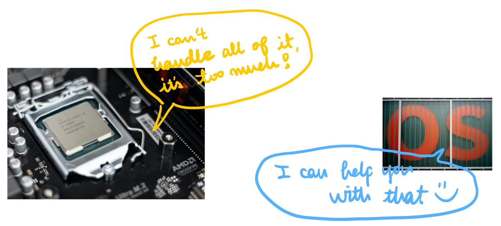
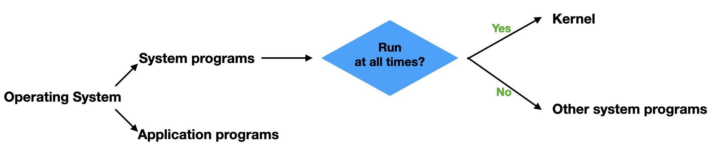
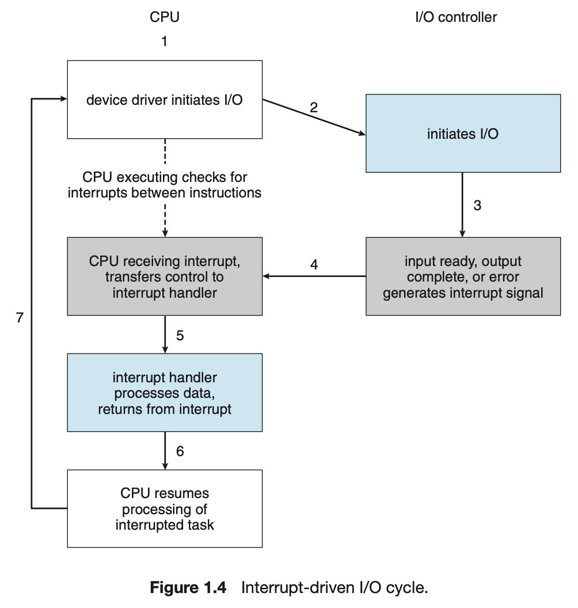

# Chapter 1. Introduction

An Operating System is software that manages a computer's hardware.
 
 

> **Objectives**
>
> - Describe the general organisation of a computer system and the role of interrupts.
> - Describe the components in a modern multiprocessor computer system.
> - Illustrate the transition from user mode to kernel mode.
> - Discuss how operating systems are used in various computing environments.
> - Provide examples of free and open-source oprating systems.

 

| Chapter |             Title              |      Link       |
| :-----: | :----------------------------: | :-------------: |
|   1.1   |   What Operating Systems Do    | 📖 [READ](#1-1) |
|   1.2   |  Computer-System Organisation  |                 |
|   1.3   |  Computer-System Architecture  |                 |
|   1.4   |  Operating-System Operations   |                 |
|   1.5   |      Resource Management       |                 |
|   1.6   |    Security and Protection     |                 |
|   1.7   |         Virtualisation         |                 |
|   1.8   |      Distributed Systems       |                 |
|   1.9   |     Kernel Data Structures     |                 |
|  1.10   |     Computing Environments     |                 |
|  1.11   | Free and Open-Source Operating |                 |

---

 

## 1.1 What Operating Systems Do

- Four components of a computer system:
  - `hardware`, `operating system`, `application programs` `user`
  - hardware: CPU, memory, I/O devices
  - application system: such as word processors, spreadsheets, compilers, and web browsers
- A computer system consists of:

  - `hardware`, `software`, `data`

- Operating system

  - provides **the means for proper use of these resources** in the opration of the computer system.
  - Controls the hardware and coordinates its use among the various application programs for the various users.
     

#### 1.1.1 User View

The user's view of the computer varies according to the interface being used.

- Laptop/PC: Maximise the work(or play) that the user is performing.
  👉🏼 **Ease of use > resource utilisation**
- Smartphone/Tablet: Touch screen, voice recognition interface.
- Home device/automobile: operating systems and applications are designed primarily to run without user intervention.

#### 1.1.2 System View

From the computer’s point of view, the operating system is the program most intimately involved with the hardware. In this context, OS is a resource allocator. 
A computer system has many resources that may be required to solve a problem: CPU time, memory space, storage space, I/O devices, and so on. The operating system acts as **the manager of these resources**.

OS in system view:

- Must decide how to allocate them to specific programs and users 👉🏼 it can operate the computer system efficiently and fairly.

- Needs to control the various I/O devices and user programs (OS is a control program).
  - Manages the execution of user programs to prevent errors and improper use of the computer.

#### 1.1.3 Defining Operating Systems

No completely adequate definition of an operating system.

Why does OS exist?

- Because they offer a reasonable way to solve the problem of creating a usable computing system.

What is the fundamental goal of computer systems?

- to execute programs and to make solving user problems easier.
- Computer hardware is constructed toward this goal. Since bare hardware alone is not particularly easy to use, application programs are developed. These programs require certain common operations, such as those controlling the I/O devices. The common functions of controlling and allocating resources are then brought together into one piece of software: the operating system.
  

- The operating system is the one program running at all times on the computer—usually called the `kernel`. Along with kernel there are two other types of programs in the OS: `system programs`, `application programs`
  

  - Kernel: A system program in the OS runs at all time
  - Other system program: A system program doesn't need to run at all time
  - Application program: All programs not associated with the operation of the system. (e.g., middleware)

### 1.2 Computer-System Organisation

A ~~modern~~(classical) general-purpose computer system consists of one or more CPUs and a number of device controllers connected through a common bus that provides access between components and shared memory.

- Typically, operating systems have a device driver for each device controller.

  - understands the device controller
  - provides the rest of the operating system with a uniform interface to the device

**1.2.1 and 1.2.2 - basics of how such a system operates**

#### 1.2.1 Interrupts

Interrupts are signals sent to the CPU by expternal devices(like I/O devices). They tell the CPU to stop its current activities and execute the appropriate part of the operating system.

##### 1.2.1.1 Overview

- The interrupt must transfer control to the appropriate interrupt service routine.
- The interrupt architecture must also save the state information of whatever was interrupted, so that it can restore this information after servicing the interrupt.

##### 1.2.1.2 Implementation

we need more sophisticated interrupt handling features.

1. The ability to defer interrupt handling during critical processing.
2. An efficient way to dispatch to the proper interrupt handler for
   a device.
3. Multilevel interrupts, so that the operating system can distinguish between high and low-priority interrupts and can respond with the appropriate degree of urgency.

In modern computer hardware, these three features are provided by the CPU and the interrupt-controller hardware. Most CPUs have two interrupt request lines :

1. The nonmaskable interrupt: it is reserved for events such as unrecoverable memory errors.

2. The maskable interrupt: it is used by device controllers to request service. it can be turned off by the CPU before the execution of critical instruction sequences that must not be interrupted.

> **interrupts are used throughout modern operating systems to handle asynchronous events.**

#### 1.2.2 Storage Structure

The CPU can load instructions only from memory, so any programs must first be loaded into memory to run. The first program to run on computer power-on is a bootstrap program, which then loads the operating system.  
Since RAM is volatile—loses its content when power is turned off or otherwise lost—we cannot trust it to hold the bootstrap program. 👉🏼 the computer uses EEPROM(erasable programmable read-only memory: infrequently written to & nonvolotile ↔ RAM )

- EEPROM:
  1. can be changed but cannot be changed frequently.
  2. low speed 👉🏼 it contains mostly static programs and data that aren’t frequently used.
     - Example: the iPhone uses EEPROM to store serial numbers and hardware information about the device.
