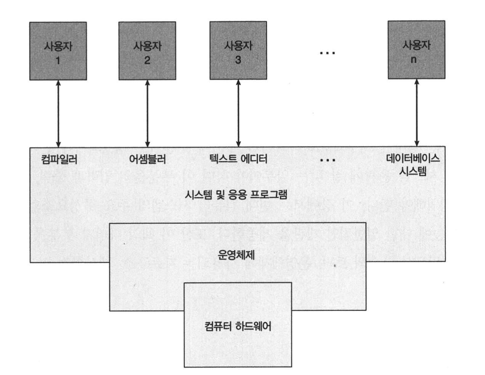

<h1 align="center">
    Opreating System : Concepts 챕터 1
</h1>

## 서론

운영체제는 컴퓨터 하드웨어를 관리하는 프로그램이다.
또한, 응용 프로그램을 위한 기반을 제공하며 컴퓨터 하드웨어 사이의 중계자 역할을 수행한다.

어떤 운영체제는 일반인들이 사용하기에 편리하도록 설계 되었고 일부는 효율성에 주안을 두고 설계 되었고 일부는 이들의 조합으로 설계되었다.

운영체제는 덩치가 매우 크고 복잡하기 때문에 부분별로 생성 되어야 한다.
이 하나의 부분은 전체 시스템의 윤곽에 잘 맞는 일부여야 하며 이 부분들의 입력과 출력, 동작은 주의를 기울여 정의해야 한다.

## 운영체제가 할 일

컴퓨터 시스템은 대게 네가지 구성 요소인 하드웨어, 운영체제, 응용 프로그램 및 사용자로 구분할 수 있다.

### 하드웨어

**중앙처리장치(CPU)**, **메모리** 및 **입출력(I/O)**로 구성되어 기본 계산용 자원을 지원한다.

### 응용 프로그램

워드 프로세서, 스프레드 시트, 컴파일러 등은 사용자의 계산 문제를 해결하기 위해 이들 자원을 어떻게 사용할 지를 정의한다.

### 운영체제

다양한 사용자를 위해 다양한 응용 프로그램 간의 하드웨어 사용을 제어하고 조정한다.
컴퓨터 시스템이 동작할 때 이들 자원을 적절하게 사용할 수 있는 방법을 제공한다.
운영체제는 정부(Government)와 유사하다. 운영체제는 정부처럼 그 자체로는 유용한 기능은 수행하지 못한다.
운영체제는 단순히 다른 프로그램이 유용한 작업을 할 수 있는 **환경**을 제공한다.

<small>컴퓨터 시스템 구조에 대한 계략적 구성도</small>

## 관점

### 사용자 관점(User View)

#### 일반 사용자

대부분의 컴퓨터 사용자는 노트북(Laptop)에서 작업하거나 모니터, 키보드, 마우스로 구성된 PC 에서 작업한다.
이러한 시스템은 한 사용자가 자원을 독점하도록 설계 되었으며 목표는 사용자가 수행하는 작업을 최대화 하는 것이다.
운영체제는 대부분 **사용의 용의성**을 위해 설계되고 성능에 약간 신경을 쓰고 다양한 하드웨어와 소프트웨어 자원이 어떻게 공유 되느냐의 **자원의 이용**에는 전혀 신경쓰지 않는다.

#### 대형 컴퓨터, 미니 컴퓨터

사용자는 대형 컴퓨터나 미니 컴퓨터에 연결된 터미널에 앉아 있는 경우도 있다.
이 경우 운영체제는 자원 이용을 극대화 하도록 설계 되어있어 모든 가용 CPU 시간, 메모리 및 입출력은 효율적으로 사용되며 각 개인은 정당한 몫만 사용할 수 있다.

#### 워크스테이션과 서버

사용자는 워크스테이션과 서버의 네트워크에 연결된 워크스테이션에 앉아 있다.
이 사용자들은 자신이 맘대로 할 수 있는 전용 자원을 갖지만 또한 네트워킹과 서버-파일, 계산 및 프린트 서버를 공유한다.

#### 스마트폰과 태블릿

최근 스마트폰이나 태블릿 같은 다양한 휴대용 컴퓨터들이 이용되고 있다.
이들 장치의 대부분은 개인 사용자들을 위한 독립형 장치 들이다.
점점 휴대용 장치들은 이메일, 웹 브라우징을 위해 컴퓨터를 사용하는 사람들에게 데스크톱, 노트북(Laptop) 컴퓨터를 대체하고 있다.

#### 기타

일부 컴퓨터는 사용자 관점이 존재하지 않거나 매우 적은 경우를 가지고 있다.
예를 들면 가전제품이나 자동차 내의 내장형 컴퓨터를 키패드를 가지고, 상태를 보이기 위해 표시등을 켜고 끌 수 있지만 이들 컴퓨터나 운영체제는 사용자의 개입 없이 작동하도록 설계 되어있다.

### 시스템 관점

#### 지원 할당자

컴퓨터의 관점에서 운영체제는 하드웨어와 가장 밀접하게 연관된 프로그램이다. 따라서, 운영체제를 **지원 할당자**로 볼 수 있다.
컴퓨터 시스템은 문제를 해결하기 위해 요구되는 여러가지의 자원들(하드웨어와 소프트웨어) 즉, CPU 시간, 메모리 공간, 파일 저장공간, 입출력 장치들을 가진다.
운영체제는 이들 자원의 관리자로서 동작하며, 작업을 위해 특정 프로그램과 사용자에게 할당한다.
운영체제는 컴퓨터 시스템을 효율적이고 공정하게 운영할 수 있도록 어느 자원에 요청 할지를 결정해야 한다.

#### 제어 프로그램

운영체제에 대한 다소 다른 관점은 여러가지 입출력 장치와 사용자 프로그램을 제어할 필요성을 강조한다.
운영체제는 **제어 프로그램**이다. 제어 프로그램은 컴퓨터의 부적절한 사용을 방지하기 위해 사용자 프로그램의 수행을 제어한다.

#### 결론

운영체제는 개인의 사용 용이성과 자원 이용간에 적절히 조화를 이루도록 설계가 되어있다.
| 컴퓨터 시스템 | 내용 |
| ----------|------|
| 하드웨어 | 1. 중앙처리장치(CPU), 메모리 및 입출력(I/O)구성  2. 기본 계산용 자원 을 지원 |
| 응용 프로그램 | 1. 사용자의 계산 문제를 해결하기 위해 이들 자원을 어떻게 사용할지 정의|
| 운영체제 | 1. 다양한 사용자를 위해 응용 프로그램 간의 하드웨어 사용을 제어하고 조정  2. 컴퓨터 시스템이 동작할 때 이들 자원을 적절하게 사용할 수 있는 방법을 제공   3. 단순히 다른 프로그램들이 유용한 작업을 할 수 있는 환경을 제공|

<small>컴퓨터 시스템 구성 정리 표</small>

| 관점                     | 내용                                                                                                                                                            |
| ------------------------ | --------------------------------------------------------------------------------------------------------------------------------------------------------------- |
| 일반 사용자              | 1. 노트북(Laptop) 혹은 모니터,키보드,마우스로 구성된 PC에서 작업   2. 한 사용자가 자원을 독점하도록 설계                                                   |
| 대형 컴퓨터, 미니 컴퓨터 | 1. 대형 컴퓨터나 미니 컴퓨터에 연결된 터미널에서 작업   2. 자원 이용을 극대화 하도록 설계   3. 모든 가용 CPU 시간, 메모리 및 입출력은 효율적으로 사용 |
| 워크스테이션, 서버       | 1. 워크스테이션과 서버의 네트워크에 연결된 워크스테이션에서 작업   2. 전용 자원을 가지고 있음  3. 네트워킹과 서버-파일, 계산 및 프린트 서버를 공유    |
| 스마트폰, 태블릿         | 1. 대부분 개인 사용자를 위한 독립형 장치   2.이메일, 웹브라우징을 목적으로 사용하는 노트북(Laptop), 데스크탑 컴퓨터를 대체                                 |
| 기타                     | 1. 사용자 관점이 존재하지 않거나 매우 적음  2. 주로 가전제품이나 자동차 내의 내장형 컴퓨터에서 사용  운영체제가 사용자의 개입없이 작동하도록 설계     |

<small>사용자 관점 정리 표</small>

| 관점          | 내용                                                                                                                                                                                                                                             |
| ------------- | ------------------------------------------------------------------------------------------------------------------------------------------------------------------------------------------------------------------------------------------------ |
| 지원 할당자   | 1. CPU 시간, 메모리 공간, 파일 저장공간, 입출력 장치들을 가짐  2. 자원의 관리자로서 동작하며, 작업을 위해 특정 프로그램과 사용자에게 할당   3. 컴퓨터 시스템을 효율적이고 공정하게 운영할 수 있도록 어느 자원에 요청할지를 결정해야 함 |
| 제어 프로그램 | 1. 컴퓨터의 부적절한 사용을 방지하기 위해 사용자 프로그램이 수행을 제어                                                                                                                                                                          |

<small>시스템 관점 정리 표</small>
