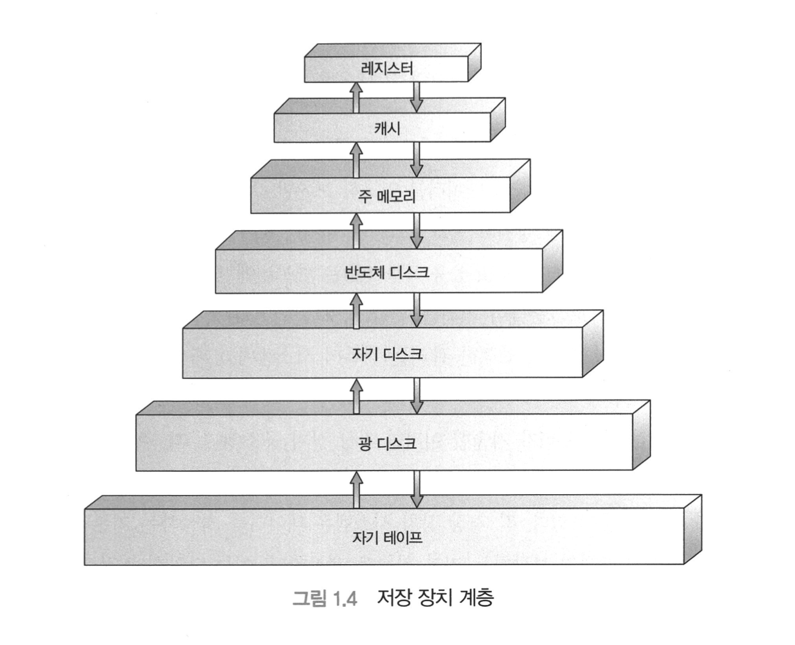

<h1 align="center">
    Opreating System : Concepts 챕터 1
</h1>

## 서론

운영체제는 컴퓨터 하드웨어를 관리하는 프로그램이다.  
또한, 응용 프로그램을 위한 기반을 제공하며 컴퓨터 하드웨어 사이의 중계자 역할을 수행한다.

어떤 운영체제는 일반인들이 사용하기에 편리하도록 설계 되었고 일부는 효율성에 주안을 두고 설계 되었고 일부는의 조합으로 설계되었다.  
운영체제는 덩치가 매우 크고 복잡하기 때문에 부분별로 생성 되어야 한다.  
이 하나의 부분은 전체 시스템의 윤곽에 잘 맞는 일부여야 하며 이 부분들의 입력과 출력, 동작은 주의를 기울여 정의해야 한다.

## 운영체제가 할 일

컴퓨터 시스템은 대게 네가지 구성 요소인 하드웨어, 운영체제, 응용 프로그램 및 사용자로 구분할 수 있다.

### 하드웨어

**중앙처리장치(CPU)**, **메모리** 및 **입출력(I/O)**로 구성되어 기본 컴퓨팅용 자원을 지원한다.

### 응용 프로그램

워드 프로세서, 스프레드 시트, 컴파일러 등은 사용자의 컴퓨팅 문제를 해결하기 위해 자원을 어떻게 사용할 지를 정의한다.

### 운영체제

다양한 사용자를 위해 다양한 응용 프로그램 간의 하드웨어 사용을 제어하고 조정한다.  
컴퓨터 시스템이 동작할 때 자원을 적절하게 사용할 수 있는 방법을 제공한다.  
운영체제는 정부(Government)와 유사하다. 운영체제는 정부처럼 그 자체로는 유용한 기능은 수행하지 못한다.  
운영체제는 단순히 다른 프로그램이 유용한 작업을 할 수 있는 **환경**을 제공한다.

    

<small>컴퓨터 시스템 구조에 대한 계략적 구성도</small>

### 결론

운영체제는 개인의 사용 용이성과 자원 이용간에 적절히 조화를 이루도록 설계가 되어있다.  
| 컴퓨터 시스템 | 내용 |
| ----------|------|
| 하드웨어 | 1. 중앙처리장치(CPU), 메모리 및 입출력(I/O)구성  2. 기본 컴퓨팅 자원을 지원 |
| 응용 프로그램 | 1. 사용자의 컴퓨팅 문제를 해결하기 위해 자원을 어떻게 사용할지 정의|
| 운영체제 | 1. 다양한 사용자를 위해 응용 프로그램 간의 하드웨어 사용을 제어하고 조정  2. 컴퓨터 시스템이 동작할 때 자원을 적절하게 사용할 수 있는 방법을 제공   3. 단순히 다른 프로그램들이 유용한 작업을 할 수 있는 환경을 제공|

<small>컴퓨터 시스템 구성 정리 표</small>

## 관점

### 사용자 관점(User View)

#### 일반 사용자

대부분의 컴퓨터 사용자는 노트북(Laptop)에서 작업하거나 모니터, 키보드, 마우스로 구성된 PC 에서 작업한다.  
이러한 시스템은 한 사용자가 자원을 독점하도록 설계 되었으며 목표는 사용자가 수행하는 작업을 최대화 하는 것이다.  
운영체제는 대부분 **사용의 용의성**을 위해 설계되고 성능에 약간 신경을 쓰고 다양한 하드웨어와 소프트웨어 자원이 어떻게 공유 되느냐의 **자원의 이용**에는 전혀 신경쓰지 않는다.

#### 대형 컴퓨터, 미니 컴퓨터

사용자는 대형 컴퓨터나 미니 컴퓨터에 연결된 터미널에 앉아 있는 경우도 있다.  
이 경우 운영체제는 자원 이용을 극대화 하도록 설계 되어있어 모든 가용 CPU 시간, 메모리 및 입출력은 효율적으로 사용되며 각 개인은 정당한 몫만 사용할 수 있다.

#### 워크스테이션과 서버

사용자는 워크스테이션과 서버의 네트워크에 연결된 워크스테이션에 앉아 있다.  
이 사용자들은 자신이 맘대로 할 수 있는 전용 자원을 갖지만 또한 네트워킹과 서버-파일, 컴퓨팅 및 프린트 서버를 공유한다.

#### 스마트폰과 태블릿

최근 스마트폰이나 태블릿 같은 다양한 휴대용 컴퓨터들이 이용되고 있다.  
장치의 대부분은 개인 사용자들을 위한 독립형 장치 들이다.  
점점 휴대용 장치들은 이메일, 웹 브라우징을 위해 컴퓨터를 사용하는 사람들에게 데스크톱, 노트북(Laptop) 컴퓨터를 대체하고 있다.

#### 기타

일부 컴퓨터는 사용자 관점이 존재하지 않거나 매우 적은 경우를 가지고 있다.  
예를 들면 가전제품이나 자동차 내의 내장형 컴퓨터를 키패드를 가지고, 상태를 보이기 위해 표시등을 켜고 끌 수 있지만 컴퓨터나 운영체제는 사용자의 개입 없이 작동하도록 설계 되어있다.

### 시스템 관점

#### 지원 할당자

컴퓨터의 관점에서 운영체제는 하드웨어와 가장 밀접하게 연관된 프로그램이다. 따라서, 운영체제를 **지원 할당자**로 볼 수 있다.  
컴퓨터 시스템은 문제를 해결하기 위해 요구되는 여러가지의 자원들(하드웨어와 소프트웨어) 즉, CPU 시간, 메모리 공간, 파일 저장공간, 입출력 장치들을 가진다.  
운영체제는 자원의 관리자로서 동작하며, 작업을 위해 특정 프로그램과 사용자에게 할당한다.  
운영체제는 컴퓨터 시스템을 효율적이고 공정하게 운영할 수 있도록 어느 자원에 요청 할지를 결정해야 한다.

#### 제어 프로그램

운영체제에 대한 다소 다른 관점은 여러가지 입출력 장치와 사용자 프로그램을 제어할 필요성을 강조한다.  
운영체제는 **제어 프로그램**이다. 제어 프로그램은 컴퓨터의 부적절한 사용을 방지하기 위해 사용자 프로그램의 수행을 제어한다.

### 결론

| 관점                     | 내용                                                                                                                                                            |
| ------------------------ | --------------------------------------------------------------------------------------------------------------------------------------------------------------- |
| 일반 사용자              | 1. 노트북(Laptop) 혹은 모니터,키보드,마우스로 구성된 PC에서 작업   2. 한 사용자가 자원을 독점하도록 설계                                                   |
| 대형 컴퓨터, 미니 컴퓨터 | 1. 대형 컴퓨터나 미니 컴퓨터에 연결된 터미널에서 작업   2. 자원 이용을 극대화 하도록 설계   3. 모든 가용 CPU 시간, 메모리 및 입출력은 효율적으로 사용 |
| 워크스테이션, 서버       | 1. 워크스테이션과 서버의 네트워크에 연결된 워크스테이션에서 작업   2. 전용 자원을 가지고 있음  3. 네트워킹과 서버-파일, 컴퓨팅 및 프린트 서버를 공유  |
| 스마트폰, 태블릿         | 1. 대부분 개인 사용자를 위한 독립형 장치   2.이메일, 웹브라우징을 목적으로 사용하는 노트북(Laptop), 데스크탑 컴퓨터를 대체                                 |
| 기타                     | 1. 사용자 관점이 존재하지 않거나 매우 적음  2. 주로 가전제품이나 자동차 내의 내장형 컴퓨터에서 사용  운영체제가 사용자의 개입없이 작동하도록 설계     |

<small>사용자 관점 정리 표</small>

| 관점          | 내용                                                                                                                                                                                                                                             |
| ------------- | ------------------------------------------------------------------------------------------------------------------------------------------------------------------------------------------------------------------------------------------------ |
| 지원 할당자   | 1. CPU 시간, 메모리 공간, 파일 저장공간, 입출력 장치들을 가짐  2. 자원의 관리자로서 동작하며, 작업을 위해 특정 프로그램과 사용자에게 할당   3. 컴퓨터 시스템을 효율적이고 공정하게 운영할 수 있도록 어느 자원에 요청할지를 결정해야 함 |
| 제어 프로그램 | 1. 컴퓨터의 부적절한 사용을 방지하기 위해 사용자 프로그램이 수행을 제어                                                                                                                                                                          |

<small>시스템 관점 정리 표</small>

### 운영체제의 정의

컴퓨터는 게임기, 음악 연주기 및 산업 제어 시스템의 기반이 된다.  
컴퓨팅은 처음 무엇을 할 수 있을지에 대한 실험으로 시작했으나 곧바로 암호깨기와 탄도 계산과 같은 군사용 및 인구조사 계산과 같은 정부 업무 등의 고정 목적 시스템으로 전용되었다.
초기의 컴퓨터들이 범용의 다기능 대형컴퓨터로 발전하였으며 그즈음 운영체제가 탄생하였다.

운영체제가 존재하는 이유는 운영체제가 시스템을 만드는 과정에서 발생하는 문제점을 해결하기 위한 적절한 방법이기 때문이다.
컴퓨터 시스템의 근본 목적은 사용자 프로그램을 실행하고, 사용자 문제의 해결을 보다 쉽게 해주는 데 있다.  
자원을 제어하고 할당하는 공통 기능을 하나의 소프트웨어로 통합한 것이 운영체제이다.

운영체제는 컴퓨터에서 항상 수행되는 프로그램으로 일반적으로 커널이라 불린다.
휴대용 운영체제는 종종 핵심커널 외에 미들웨어-애플리케이션 개발자에게 소프트웨어 프레임워크 집합을 포함한다.

## 컴퓨터 시스템의 구성

우리는 시스템 동작을 배우기 전에 컴퓨터 시스템 구조에 대한 일반적 지식을 가질 필요가 있다.  
우리의 배경 지식을 완전하게 만들기 위하여 컴퓨터 시스템 구조의 여러 부분을 살펴본다.

### 컴퓨터 시스템 연산

    

위의 그림을 보자면, 범용 컴퓨터 시스템은 공유 메모리에 대한 접근을 제공하는 공통 버스에 의해 연결된 여러 개의 장치 제어기와 하나 이상의 CPU로 구성되어 있다.  
CPU와 장치 제어기는 메모리 사이클을 얻기 위해 병렬 수행 될 수 있다.

컴퓨터가 구동을 시작하기 위해서는, 수행할 초기 프로그램을 가져야 한다.
보통 이것을 **펌웨어**라고 부르는데, 펌웨어는 컴퓨터 내의 ROM(Read-Only Memory)나 EEPROM(Electrically Erasable Programmable Read-Only Memory)에 저장된다.

커널에 적재되고 수행이 시작되면 시스템과 사용자에 서비스를 제공할 수 있다.
일부 서비스는 커널이 아닌 시스템 프로그램에 의해 제공되며 이들은 부트 시에 메모리에 적재되어 커널이 수행되는 동안 계속 수행되는 **시스템 프로세스**나 **시스템 디먼**이 된다.

이벤트가 발생하기 시작하면 하드웨어 또는 소프트웨어로부터 발견된 **인터럽트**에 의해 신호가 보내진다.
하드웨어는 어느 순간이든 시스템 버스를 통해 CPU의 신호를 보내 인터럽트를 발생할 수 있다.
소프트웨어는 **시스템 호출**이라고 불리는 특별한 연산을 실행하여 인터럽트를 발생시킬 수 있다.

CPU가 인터럽트 되면, CPU는 하던 일을 중단하고, 즉시 고정된 위치로 실행을 옮긴다.
인터럽트 서비스 루틴의 실행이 완료되면, CPU는 인터럽트 되었던 연산을 제어한다.

인터럽트는 컴퓨터구조의 가장 중요한 부분이다.
각 컴퓨터 설계는 인터럽트 매커니즘을 가지고 있으며, 몇가지 기능은 공통적이다.

- 매우 빠르게 처리되어야 하고, 사용 가능한 인터럽트의 수가 미리 정의되어 있으므로, 인터럽트 루틴에 대한 포인터들의 테이블을 사용할 수 있다.
- 일반적으로 포인터들의 테이블은 하위 메모리에 저장된다.
- 인터럽트가 요청될 때 **인터럽트 백터**가 인터럽트 요청과 함께 주어진 고유의 유일한 장치 번호로 색인 된다.
- 인터럽트 구조는 인터럽트된 명령의 주소를 반드시 저장해야 한다.

**저장장치의 정의와 표기**

> 컴퓨터 저장장치의 기본단위는 '비트'이다. 한 '비트'는 0과 1 두 값중 하나를 가진다.
> 컴퓨터의 모든 저장장치는 비트의 집합에 기반한다.
> 워드는 주어진 컴퓨터 구조의 본연 데이터 단위이다. 한 워드는 하나 이상의 바이트로 구성된다.

### 저장장치 구조

CPU는 명령어를 단지 메모리로부터 가져올 수 있으므로 프로그램을 수행하면 반드시 메모리에 있어야 한다.
범용 컴퓨터는 대부분의 프로그램을 RAM(Random-Access Memory, 주메모리)에서 가져온다.

ROM은 변경할 수 없으므로 앞에 설명한 부트스트랩 프로그램과 같은 정적 프로그램을 저장한다.
EEPROM은 변경할 수 있으나 자주 변경할 수 없으며 대부분 정적 프로그램을 저장하고 있다.
모든 형태의 메모리는 바이트의 배열을 제공한다.

- 상호 작용
  1. 특정 메모리 주소들에 대한 일련의 적재(load), 저장(store) 명령을 통해 이루어진다.
- 적재 명령
  1. 주 메모리로부터 CPU 내부의 레지스터로 한 바이트 또는 한 워드를 옮기는 것이다.
- 저장 명령
  1. 레지스터의 내용을 주로 옮긴다.
  2. 명시적인 적재, 저장 명령 외에는 CPU 실행을 위해 자동적으로 주 메모리로부터 명령을 인출해, 그 명령을 **명령 레지스터(insturaction Register)** 에 저장한다.
  3. 메모리로부터 피연산자를 인출하여 내부 레지스터에 저장하도록 유발할 수 있다.
  4. 메모리는 **명령 카운터(insturaction counter)**, **색인(indexing)**, **간접 주소(indirection)**, **리터럴 주소(literal adress)** 등 주소가 어떻게 생성 되었는지 알지 못하며, 해당 주소의 명령인지 데이터인지 알지 못한다.

이상적으로는, 프로그램과 데이터가 주 메모리에 영구적으로 존재하길 바란다. 그러나, 다음 두가지의 이유로 인해 불가능하다.

1. 주 메모리는 모든 필요한 프로그램과 데이터를 영구적으로 저장하기에는 너무 작다.
2. 주 메모리는 전원이 공급되지 않으면 그 내용을 잃어버리는 **휘발성 장치**이다.

그러므로 대부분의 컴퓨터 시스템은 주 메모리의 확장으로 보조 저장 장치를 제공 한다.
**보조 저장 장치**의 주요 요건은 대량의 데이터를 영구적으로 보존할 수 있어야 한다는 점이다.
대부분의 시스템과 응용 프로그램은 메모리에 적재될 때 까지 디스크에 저장된다.
디스크 장치의 적절한 관리는 컴퓨터 시스템에서 매우 중요하다.

    

위 계층을 참고하자면 컴퓨터 시스템에서 저장 장치 시스템은 넓은 다양성은 속도와 가격에 따라 하나의 계층으로 구성될 수 있다.
상위 수준은 가격이 비싸지만 빠르다. 계층 구조의 아래로 갈수록 비트당 비용은 감소하며, 접근시간은 증가한다.

서로 다른 비용과 속도를 갖는 것 외에도, 여러 저장 시스템은 휘발성 또는 비휘발성으로 구분된다.

- 휘발성: 전원이 공급되지 않으면 저장하고 있는 내용을 잃는다.
- 비휘발성: 휘발성과 반대로 전원이 공급되지 않아도 저장하고 있는 내용을 유지한다.
  1. 반도체 디스크: 자기 디스크보다 빠르며 비휘발성이다.
  2. 플래시 메모리: DRAM에 비해 속도는 느리지만 데이터를 유지하기 위해 전원이 필요하지 않다.
  3. NVRAM: 배터리 예비 전원을 가진 DRAM과 마찬가지이며, DRAM만큼 빠르지만 배터리가 소모될 때 까지 비휘발성을 유지한다.

완전한 메모리 시스템의 설계는 이러한 모든 요인의 균형이 맞아야 한다.
두 구성 요소의 전송률 또는 접근 시간의 차이가 클 경우 개선하기 위하여 **캐시 메모리**가 설치될 수 있다.
